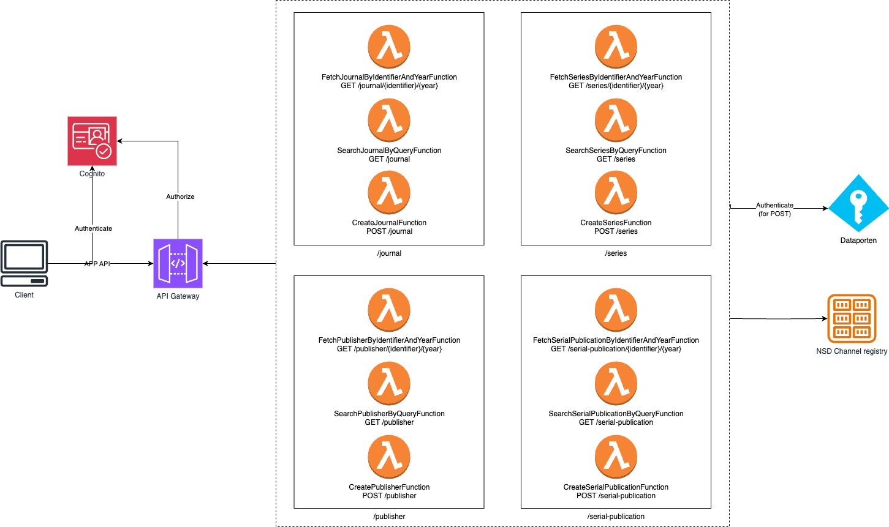

# nva-publication-channels-java

A client to wrap HKDir DBH's publication channel databases.



## Cached data

Sometimes, you may wish to resolve many resources (semi-) simultaneously, which DBH will not like.
In these cases, upload the data set (format: csv, see
_.../channelregistrycache/db/model/ChannelRegistryCacheDao.java_) to the s3
bucket _channel-register-cache-{accountIt}_ and configure the `ApplicationConfigurationProfile` with
the following profile:

```json
{
  "publicationChannelCacheEnabled": true
}
```